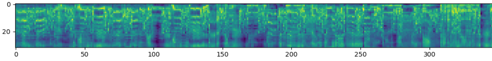
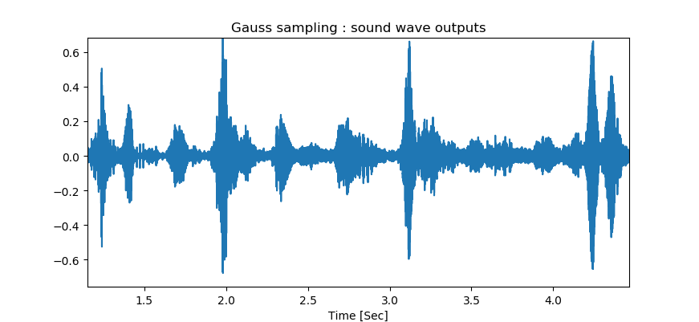

# MelNet-Tensorflow(WIP)
## Introduction
implementation of melnet(FAIR) using tensorflow https://arxiv.org/pdf/1906.01083.pdf
Generation of singing voice(Unconditional) , Data was taken from youtube and was converted to wav files.
The model was trained on 1 singer Ariana Grande, 2 hours of singing.

### data set:
Fs: 48[KHz] -> donwsampled to 24[KHz].
- Melspectrogram parameters: 

   fft_size = 2048  -> window size for the FFT

   n_mel_freq_components = 32  -> number of mel frequency channels

   start_freq = 300  -> Hz What frequency to start sampling our melS from

   end_freq = 8000  -> Hz  What frequency to stop sampling our melS from

   Time_window = 50  -> Time window to slice the spectrograms

   Each input contains matrix of size: (32,50)

### Train:
RMSPOP optimizer with lr: 7e-4 , momentum: 0.9.
Every 10 epochs learning rate was down in half-> lr/2
Tested with batch size:16
### Generations (Current results):

### Time domain signal

### Audio generation
sound of Ariana Grande (Unconditional)
[SOUND](/no_filt2222_08_57.wav	) 

## How to use? 
Main script: MelNET.py
Trainning:
- prepare data:
making_mel_Spec.py

def create_data_train -> get path to wav files folder and creates mel spectrogram

- Graph creation:

   def MelNET -> Main function creates the graph

   def FrequencyDelayedStack -> LSTM along the frequency axis (reusing weights)(input delay along frequnecy axis)

   def TimeDelayedStack -> LSTM along  frequency  and time axis (reusing weights)(input delay along time axis)

   def gaussian_mixture_loss -> Gmm loss function

- generating sample by sample using GMM :

   def generating_from_disribution_new -> receive GMM model of the spectrogram and sample pixel distribution.
   
   def return_to_audio -> Receive a spectrogram and sampling rate, produces the audio signal.
   

** At the moment the generation process takes a lot of time because  generation  is done pixel by pixel. In the next few weeks intend to improve efficiency.
The audio results from generation are very noisy -> intend to train the model over larger dataset for longer time and update the results.

